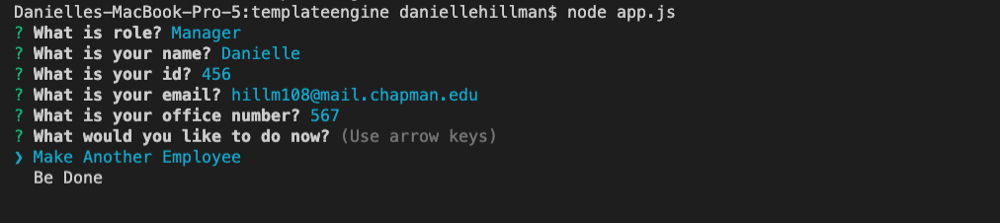
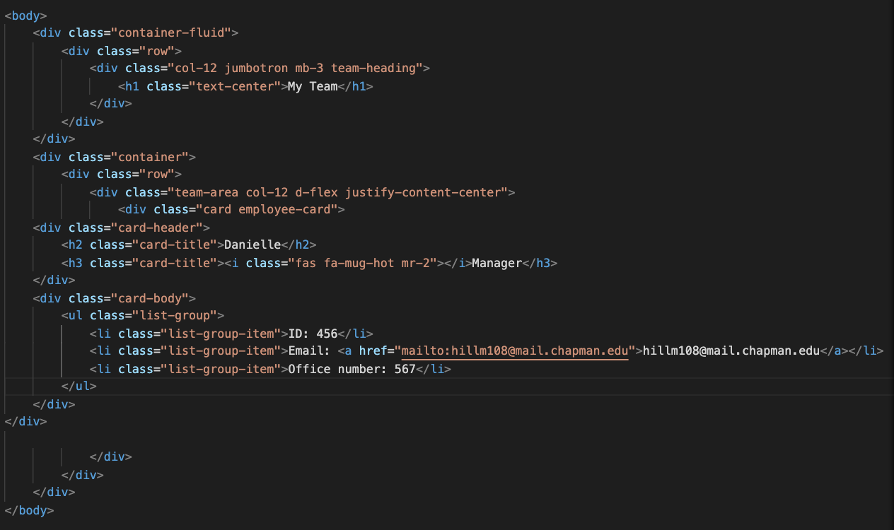
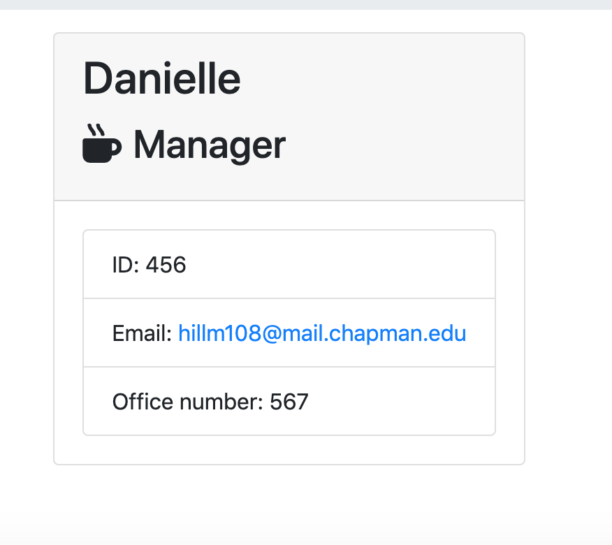

# Template Engine

Created by me: *Danielle Hillman*

## This application allows the create a team

Using user input, the command line intakes the following: Name, Email, Id and role. Based on the role, additional questions wil be asked. Once the user chooses "Be Done", the array will stop and render team.html

### Changes

Taking the user's info, the application places that current information into the team.html.

### Output

After the html is rendered, the user and deploy and see each employee on the page in specific cards.

## Video

Video name: templateengine

Link to Video: https://drive.google.com/drive/folders/1DT1ZBO42LacoAtv2lfW_e3EbhNZ7us_u

